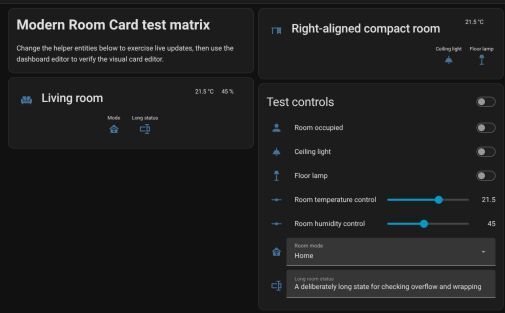
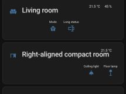

# Modern Room Card

A flexible, maintained room card for Home Assistant dashboards. Combine a room title, a state-aware main entity,
header information, configurable entity rows, actions, and conditional appearance in one responsive card.



<details>
<summary>Mobile layout</summary>



</details>

## Highlights

- Full visual editor with responsive mobile layout
- Default and compact card layouts
- Header info entities and aligned entity rows
- Custom names, icons, states, empty alignment slots, and nested cards
- Tap, hold, and double-tap actions
- State-aware icon colors and conditional card appearance
- Home Assistant theme, RTL, keyboard, and reduced-motion support

## Installation

### HACS

1. In HACS, open **Dashboard** → **Custom repositories**.
2. Add this repository with category **Dashboard**.
3. Install **Modern Room Card**, then reload Home Assistant.

If HACS does not add the resource automatically, add
`/hacsfiles/ha_modern-room-card/modern-room-card.js` as a JavaScript module.

### Manual

Run `npm ci && npm run build`, copy `dist/modern-room-card.js` to Home Assistant's `config/www` directory, then add
`/local/modern-room-card.js` as a JavaScript module resource.

## Quick start

Add the card through Home Assistant's visual card picker or use YAML:

```yaml
type: custom:modern-room-card
title: Living room
entity: light.living_room
icon: mdi:sofa
tap_action:
  action: toggle
info_entities:
  - entity: sensor.living_room_temperature
    format: precision1
rows:
  - entities:
      - entity: light.ceiling
        name: Ceiling
      - entity: media_player.living_room
        name: Media
```

The visual editor covers everyday configuration. Advanced options remain available in YAML.

## Documentation

Complete documentation is maintained in the [Modern Room Card wiki](https://github.com/cybearde/ha_modern-room-card/wiki):

- [Installation](https://github.com/cybearde/ha_modern-room-card/wiki/Installation)
- [Configuration](https://github.com/cybearde/ha_modern-room-card/wiki/Configuration)
- [Visual editor](https://github.com/cybearde/ha_modern-room-card/wiki/Visual-Editor)
- [Conditional appearance](https://github.com/cybearde/ha_modern-room-card/wiki/Conditional-Appearance)
- [Development and testing](https://github.com/cybearde/ha_modern-room-card/wiki/Development-and-Testing)

## Development

```bash
npm ci
npm run check
npm run e2e -- tests/e2e/runtime.spec.ts
```

For live integration testing, serve the current bundle from a development Home Assistant installation and use an
authenticated Playwright storage-state file as described in the wiki.

## License

[MIT](LICENSE). Previous copyright notices are retained in the license file.
